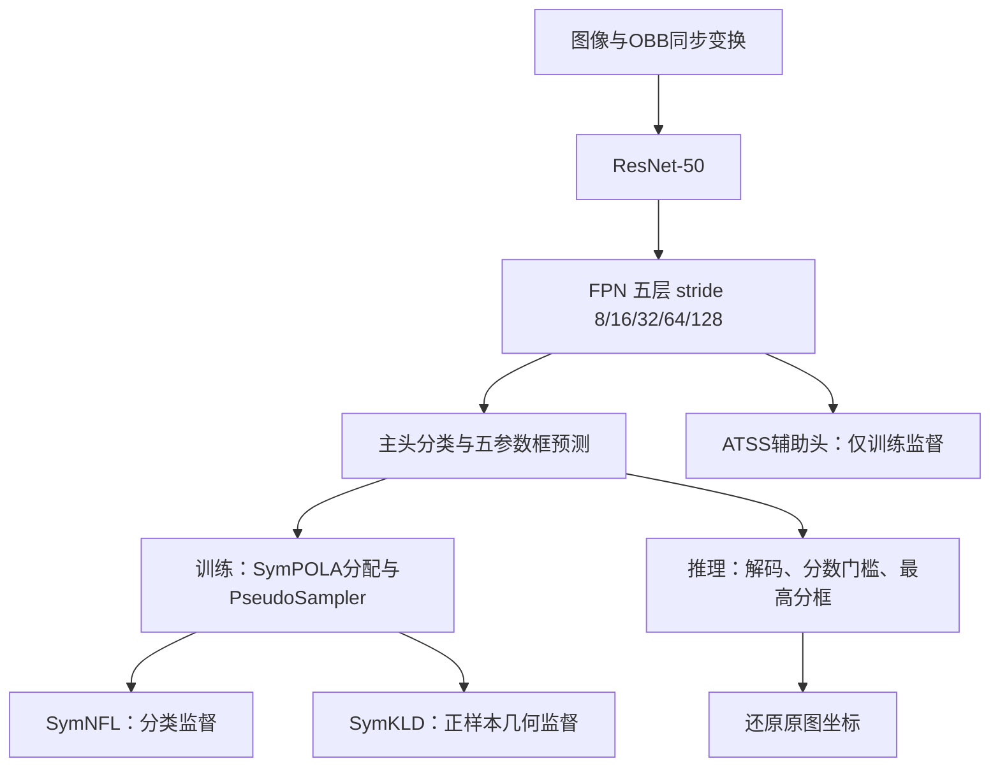

# 港口新数据集与 EOOD / SymEOOD 尺度增强实验总记录

更新日期：2026-10-01。

本文是当前港口检测实验的数据、方法、结果与论文素材主记录。后续成果集中更新本文；执行过程、代码审查和新窗口任务边界见[几何优化交接](../geometry_precision_handoff_20261001.md)。旧DINO/旧数据结果保留在[蒸馏记录](../dino/DINO到SymEOOD蒸馏实验总记录.md)和其他历史主文档，不混入当前主表。

**当前状态：保留 SymEOOD＋等比例尺度增强 B（VAL选epoch24）。中心—尺寸补偿D已完成，TEST没有整体优势，不替换B。同中心协方差形状补偿E仅完成设计，尚未实施、训练或取得收益。**

本次整理读取了现有代码、数据README、交接和本地报告/终端附件，没有重新训练、推理、连接服务器或修改模型。部分TEST结果只有用户终端记录，不能将本文当作所有checkpoint及逐帧产物已重新审核的证明。

## 1. 研究问题与已有成果

当前任务是单类抓斗旋转框检测，既需要足够的目标输出和中心正确覆盖，也需要定位、尺寸和方向精度，以支持后续视觉测量。当前成果主要体现在真实港口检测覆盖与连续失败改善，尚未解决全部跨域几何精度取舍。

| 工作 | 已取得的结果 | 限制 |
|---|---|---|
| 公开＋自采＋仿真数据统一 | 固定含seq06的新划分，TRAIN2558、VAL887、TEST1440；新增日间图已采样、轴线标注并转OBB | 不是未知港口泛化证明；当前TEST已多次暴露 |
| 同数据EOOD/SymEOOD对照 | 无增强下，real全帧中心正确覆盖84.68%→92.05%，MCML101→29 | sim RIoU及角度精度退化，不能宣称全面领先 |
| 等比例尺度增强B | SymEOOD real全帧中心正确覆盖92.05%→98.85%，MCML29→4；同时sim RIoU0.8564→0.8816 | 普通尺度增强本身不是新算法；sim时序指标有代价 |
| EOOD＋相同尺度对照 | EOOD real覆盖84.68%→96.43%，MCML101→8 | 表明收益不是SymEOOD独有；必须保留该对照 |
| TRAIN/VAL几何分解 | 分离中心、尺寸、角度及罚项；发现SymEOOD B的普通框尺寸/定位缺口 | 最终框不能单独定位分类排序或回归根因 |
| 中心—尺寸补偿D | VAL修复部分严重错位，但TEST未形成整体收益 | 本版负结果，不能作为已验证新方法 |

上述“成果”指已记录的实验观察。每个正式方案目前是单次训练，未形成多种子稳定性或统计显著性结论。本文没有将普通增强或负结果自动认定为论文创新。

## 2. 当前数据集与来源

### 2.1 固定主划分

本地根目录：`/Users/mac/Documents/paper/symEOOD/crane_project/data/crane_grab_port_day2night_v1`。

服务器采用同一相对目录。各集合以 `images/` 和 `annfiles/` 配对，real TRAIN在 `train/`，sim TRAIN在 `train_sim/`，VAL和TEST分别在 `val/`、`test/`。

表1：当前固定数据划分；序列按公开、自采港口和仿真来源区分。

| 集合 | 公开真实数据 | 自采港口数据 | 仿真数据 | real | sim | 总计 |
|---|---|---|---|---:|---:|---:|
| TRAIN | real_seq01：339 | real_seq05：560；real_seq06：466；real_seq12：141；real_seq13：304 | sim_seq08：748 | 1810 | 748 | 2558 |
| VAL | real_seq07：226 | real_seq14：149 | sim_seq10：512 | 375 | 512 | 887 |
| TEST | real_seq03：200 | real_seq04：668，夜间 | sim_seq09：572 | 868 | 572 | 1440 |
| 合计 | 765 | 2288 | 1832 | 3053 | 1832 | 4885 |

公开real_seq02不参与本版主划分，原数据保留。公开数据集的正式名称、许可和引用仍需原始来源材料确认，不能将公开序列称为自行采集。sim三个序列与旧版图像/标注逐字节一致，未重新划分。

公开序列覆盖与自采数据互补；自采日间TRAIN及夜间TEST提供同港口不同光照条件的评价。该设置不等同于未见港口或未见设备的泛化评价。按原视频/连续采集事件分组；同场景本身既不能直接判定泄漏，也不能证明不存在近重复。

### 2.2 新增自采日间标注

| 项目 | 内容 |
|---|---|
| real_seq12 | `1 (13).mp4` 与 `1 (1).mp4` 的连续内容合并，141张 |
| real_seq13 | `1 (7).mp4`，304张 |
| real_seq14 | `1 (10).mp4`，149张，用作VAL |
| 采样 | 新增三组3 FPS；编号与源帧/时间映射保留在采样和provenance记录中 |
| 标注 | X-AnyLabeling轴线；中央参考结构，不是全部张开斗体外轮廓 |
| 转换 | 轴线长作为框长，框短边=长边/2.1，统一转换和重命名后进入项目 |
| 尺寸 | seq12为1280×720；seq13/14为1920×1088 |

轴线构框的 **k=2.1** 不等于模型 **K=1**，也不是深度标定系数。既有真实标注直接保留，不能称全部real都按k=2.1生成；sim参考结构长宽比约2.91，不要求与real相同。

源视频存在噪点、压缩和解码异常；新增VAL包含已标注模糊帧。不能写成全部源视频无损或全部异常帧已剔除。seq12的00121→00122约有9秒时间缺口，编号相邻不代表物理连续，不能跨该处直接计算连续运动。

### 2.3 新旧版本关系

旧主划分为TRAIN2781（real2033＋sim748）、VAL738、TEST992（real420＋sim572）；旧real TRAIN为01/04/05/06，real TEST为02/03。新主划分将04移至TEST、加入12/13，后来恢复06。

早期无06的新版本real TRAIN1344，加sim后TRAIN2092；恢复06后real TRAIN1810，TRAIN2558。前者只是历史数据组成对照，不再作为当前主实验版本。当前文件名不带seq06，但实际包含该序列。

恢复06改善了SymEOOD表现，但也改变数据数量、分布与每epoch优化步数。因此它只能解释为“恢复seq06这一整体干预”的观察结果，不能单独证明目标尺度、额外样本量或某场景外观是唯一原因。

seq04曾用于旧模型训练。当前新数据实验从ImageNet初始化，不能用接触过seq04的旧项目权重作为无泄漏起点。当前固定TEST已多次诊断，应在论文中披露；后续新设计与选权只用TRAIN/VAL。

## 3. 模型与实验身份

### 3.1 EOOD与SymEOOD

EOOD K=1保留项目中的原方法路线，作为主要方法基线；K=1指主头之外保留一个ATSS辅助头，不是原完整多辅助头配置。当前训练/评估应用于自定义数据，不能表述为在原论文公开基准上完整复现全部结果，论文应给原方法正式引文并描述本项目训练协议。当前本地实现与配置声明之间的一处差别见3.8节；本次没有核验服务器历史代码快照。

SymEOOD K=1使用ResNet-50＋FPN主干/颈部，主头通过SymNFL分类损失、SymKLD旋转框回归和SymPOLA预测感知分配训练，并保留原辅助监督分支。当前主结果比较的是这套整体改动，尚不能由EOOD/SymEOOD两组差异分别归因于其中每个模块。

SymEOOD推理主头score_thr=0.05、max_per_img=1；EOOD沿用原多候选和旋转NMS路径，离线统计使用最高分第一行框。不能为了比较默默修改后处理，也不能为SymEOOD虚构RPN/NMS候选链。

### 3.2 当前实验矩阵

表2：完成状态及VAL选择；“基线/对照”是实验角色，不按TEST优劣替换身份。

| 实验 | 改动 | VAL选权 | 状态/用途 |
|---|---|---|---|
| EOOD A | 当前数据，原模型，无新增增强 | epoch24 | 论文主要方法基线，已完成 |
| SymEOOD A | 当前数据，SymEOOD，无新增增强 | epoch20 | 模型整体对照，已完成 |
| EOOD＋尺度B | EOOD A＋与SymEOOD B一致的尺度增强 | epoch24 | 公平增强对照，已完成；不替换原主基线 |
| SymEOOD B | SymEOOD A＋尺度增强 | epoch24 | 当前保留方案，已完成 |
| SymEOOD C | SymEOOD A＋real光照增强 | epoch16 | 单独增强对照，已完成；不与B组合 |
| SymEOOD D | SymEOOD B＋中心—尺寸补偿 | epoch22 | 负结果/取舍对照，已完成，不替换B |
| SymEOOD E | SymEOOD B＋同中心协方差形状项 | 未选权 | **只有设计，未实施/训练** |

此处A/B/C是新港口实验命名，不能与旧DINO梯度蒸馏的A/B/C混用。

### 3.3 训练参数与选权

正式模型均从相应原配置的ImageNet初始化开始，不从已训练A、B或旧K1续训。新数据入口使用继承，仅覆盖数据路径和work-dir；B/C继承SymEOOD A，D继承B。

| 参数 | 当前固定设置 |
|---|---|
| 主干初始化 | `torchvision://resnet50`；load_from/resume_from为None |
| 冻结 | frozen_stages=1，不是整个主干冻结 |
| 训练预算 | 24epoch；seed0 |
| 批量 | 两卡×每卡2张，总batch4；每卡workers2 |
| 优化器 | SGD lr0.0025、momentum0.9、weight_decay0.0001 |
| 梯度裁剪 | max_norm10 |
| 学习率 | linear warmup1000，warmup_ratio0.001，step `[16,22]` |
| VAL扫描 | epoch16、18、20、22、24 |
| 硬约束 | Rc_w≥扫描最大值−0.005；MCML≤5 |
| 软评分 | 0.35×TDR＋0.25×Rc＋0.20×ACI＋0.20×AngleScore |
| 域权重 | sim0.7、real0.3 |
| TEST | 由VAL结果绑定固定checkpoint，不在TEST选epoch |

SymEOOD原SymKLD权重2，SymNFL/SymPOLA及辅助损失在B/C/D中保持原设置。EOOD＋尺度显式保留24份checkpoint，避免最终丢失16/18轮；这是保存策略改变，不是训练梯度改变。

训练在线VAL与正式离线VAL/TEST不是相同指标流程：在线配置real中心阈值25px、sim10px并记录mAP等；离线评估中心阈值统一15px。论文主表采用下面定义的离线协议，不将在线训练日志直接混入主表。

### 3.4 实际网络与训练/推理流程

本节按当前本地代码描述方法，不能由配置中的`stacked_convs=4`推定主头实际执行了四层分类/回归塔：`SymEOODHead.forward_single()`直接把FPN特征送入`retina_cls`和`retina_reg`预测卷积。当前配置未启用分类适配器，因此分类与回归都读取同一FPN输入，各自预测参数独立。



主头使用每位置三种比例锚点（0.5、1、2），单尺度、base scale4；OBB解码沿用`le90`、`edge_swap=True`、`proj_xy=True`。辅助ATSS头用topk9分配和低权重分类/回归监督，共享backbone/FPN，因此能影响表示学习；当前默认推理不融合辅助头。

当前SymEOOD调用`with_nms=False`，按0.05分数门槛和`max_per_img=1`输出。配置虽有`nms`字段，但不能据此描述为实际执行NMS。当前A/B/C/D未启用DINO特征蒸馏、分类适配器、候选选择新损失、退化分类辅助分支或其他可选调制项。比例增强和D补偿不会新增部署模块，但尚无统一硬件测速可证明具体速度收益。

### 3.5 SymKLD：中心、尺寸与方向的联合几何监督

**动机：** 用联合几何距离替代主头原回归路线，避免把角度周期、宽高交换和其他框参数完全视为独立标量。是否改善各类几何误差仍须实验验证。

对旋转框`b=(cx,cy,w,h,theta)`，取二维高斯均值`m=(cx,cy)`，协方差为：

```text
Sigma = R(theta) diag((w/2)^2, (h/2)^2) R(theta)^T
delta = m_pred - m_gt
C = 0.5 delta^T (Sigma_pred^-1 + Sigma_gt^-1) delta
S = 0.5 [tr(Sigma_gt^-1 Sigma_pred) + tr(Sigma_pred^-1 Sigma_gt) - 4]
d_sym = C + S
f(x) = min(sqrt(1+x)-1, 10)
L_SymKLD = 2 * weighted_reduce(f(d_sym), positive_normalizer)
```

在数值保护未激活时，`d_sym`是两个方向KL之和（Jeffreys divergence），**不是平均**。C衡量中心偏差，但其逆协方差也依赖尺寸/方向；S联合衡量尺寸与方向，不读取中心。因此原SymKLD已有中心、尺寸和角度监督，D/E只是改变监督形式或相对强度。

宽高交换并加90°、角度加180°的等价框有相同协方差；共同等比例缩放时距离理论不变。严格正方形协方差不含方向，不同旋转的正方形可能RIoU不同却有相同高斯表示。近方形角度约束变弱不能写成所有方向误差都已解决。

实际实现含宽高至少1、行列式下限、逆矩阵限幅和raw上限1e4；这些保护附近不保证严格尺度不变。最终f在raw>120时被截为10，该支路梯度为零；不能仅凭存在上限推断训练大量饱和。源码中“sqrt比log更强压制极端梯度”的注释不是正确数学依据：sqrt导数比log衰减慢，最终上限是独立保护。本次只纠正文档解释，未改源码或历史实验。

### 3.6 SymNFL：几何感知的Focal权重

**动机：** 在普通分类监督中引入当前预测框与GT的几何关系，让邻近区域的分类训练具有几何感知；不是把最终分类分数直接定义成IoU。

当前方案使用硬分类标签，`gamma=2`、`alpha=0.25`、loss weight0.25，`use_quality_target=False`。其形式为：

```text
FL(p,y) = alpha_y (1-p_y)^2 BCE(logit,y)
mu_i = 1                                          # 默认
mu_i = 1 + exp(-stop_gradient(min_j d_sym(b_i,g_j))/tau)
                                                    # 被空间Top-K选中的候选
L_SymNFL = 0.25 * weighted_reduce(mu_i * FL_i, positive_normalizer)
```

先以detach的中心距离选邻近Top-K（默认300），只对这些候选计算分块KLD（chunk256）；其他候选仍计算普通Focal。正常有限情况下mu在1到2之间，乘到正/负标签的损失上：提高正样本损失推动目标分数，提高负样本损失推动背景分数降低。不能描述成只给高质量正样本加权，也不能把它称为本版QFL/VFL。

**梯度与范围：** 几何权重中的KLD被detach，不直接通过该权重更新框预测；分类梯度仍更新预测卷积及共享FPN/backbone。实际主头在每FPN层展开当前GPU的batch，把该层正样本对应的解码GT集合传入损失；当前Top-K及最小距离不是显式按图像分组计算，不能写成严格逐图GT筛选。没有该层正样本GT时退回普通Focal权重。

tau按内部调用次数除以5近似训练步数，在前1000步由10降到1。空间筛选/分块限制昂贵几何计算的范围，不代表整个检测训练只剩O(K)，也没有本轮测速支持“减少99%总计算”的量化主张。现有整体对照尚不能证明该模块单独改善困难样本分类。

### 3.7 SymPOLA：预测感知的渐进正样本分配

**动机：** 同时使用分类状态和联合框质量分配监督，在早期保留多个正样本，随后收敛到单候选，缓和直接单正样本训练的冷启动。当前代价为：

```text
p = sigmoid(logit)
class_cost = 0.25 * (1-p)^2 * [-log(p + eps)]   # GT类别的正项
cost = class_cost + 2 * d_sym / (tau + eps)
```

分配读取detach预测，整段`no_grad`，不对argmin/topk选择求导；选出的标签随后进入分类与回归训练。tau在前1000近似步由10降到1；每GT的正样本数调度为前2000步9个，接下来2000步由9递减到1，之后保持1。配置`o2m=False`不表示整个训练始终只有一个正样本。

步数用逐图调用计数除以2近似，依赖本版每卡batch2；两卡各自计数，不能随意改每卡batch而宣称调度完全相同。单候选阶段是每GT最小代价选择，不是完整Hungarian匹配；当前单类、每图单GT设置不能直接证明多目标冲突解决性质。SymPOLA改变正样本选择，不保证每个RIoU合格框都被标为正，也不等价于固定RIoU质量下界。

### 3.8 总损失、归一化与EOOD基线实现边界

SymEOOD A/B/C当前有效目标为`L_SymNFL + L_SymKLD + L_aux`；其中主头权重已包含在3.5/3.6公式内，不能重复乘。ATSS辅助分类是weight0.01的Focal，辅助回归为weight0.01、beta1的SmoothL1。D再增加7.2节的补偿项，E只登记7.3节设计。

主头共享归一化是**当前GPU batch全部FPN层的正样本计数**：先逐图累计`max(正样本数,1)`，再作为每层`avg_factor`。这里“全局正样本”表示跨FPN层汇总，不是跨两张GPU做all-reduce的全局平均；交接公式的`global_positive_count`按这一范围理解。归一化不应因新增损失偷偷改成逐层正样本数。

EOOD配置声明主头Focal weight2、L1 weight1、RotatedIoU weight2；但当前本地`RotatedEoodHead.loss()`虽然计算L1，返回训练loss字典只有`loss_cls`和`loss_iou`，未返回`loss_bbox`，因而L1不进入当前主头最终反向目标。论文不能只抄配置就称实际使用完整L1＋IoU组合。该静态发现不证明服务器历史训练版本相同，也不证明它导致某项性能差距；本次文档任务不改变代码、重训或重命名已完成结果。正式复现时应绑定实际代码快照与日志，区分项目K1实现和原论文完整协议。

### 3.9 改进链条与尚缺的模块证据

| 层次 | 实际改动 | 主要希望改善什么 | 当前证据边界 |
|---|---|---|---|
| 原模型→SymEOOD | 联合几何回归、几何感知分类权重、预测感知分配 | 分类/定位协调与有效输出 | 整体对照有real覆盖收益，三模块未独立消融 |
| SymEOOD A→B | 训练期等比例缩小，模型目标不变 | 扩展输入目标尺度分布 | real覆盖/连续性及部分几何改善，EOOD也受益 |
| SymEOOD A→C | 仅real的光照扰动 | 光照外观鲁棒性 | 当前单独配置未取得收益，不与B混写 |
| B→D | 正样本额外中心与长短边监督 | 中心/尺寸回归补偿 | VAL部分修复，TEST无整体收益 |
| B→E | 计划增加同中心协方差形状项 | 强化尺寸—方向联合监督 | 尚未实现，无收益证据 |

这些层次分别属于模型监督、输入增强和几何目标适配。普通尺度增强不是独有创新，SymEOOD命名也不能代替方法差异与实验贡献；当前最清楚的已验证优势是real正确覆盖与连续失败改善。

## 4. 尺度增强及测量几何约束

### 4.1 B的具体变换

B在real与sim的TRAIN管线中，RResize后、flip/Normalize/Pad前，以0.5概率执行：

```text
s ~ Uniform(0.5, 1.0)
图像：零平移等比例仿射缩小，输出画布尺寸向上取整
OBB：(cx, cy, w, h)乘同一个s，角度不变
scale_factor：累乘s；ori_shape：保留
后续：原随机翻转、Normalize、右侧/底部Pad至1024×1024
```

没有s>1的放大，没有裁剪或居中偏移，不改变GT长宽比。测试/部署不执行此增强，不增加网络参数或新的推理模块。坐标相对本步变换可通过除s恢复；缩小丢失的图像细节不可恢复。

实现：[port_train_augment.py](../../mmrotate/datasets/pipelines/port_train_augment.py)，类 `PortIsotropicShrink`。现有CPU检查覆盖像素/框一致性、元数据、空框、跳过分支及逆坐标映射。尺度增强有效的数值依据来自正式实验，不来自单元测试。

### 4.2 C的光照变换

C仅real TRAIN，以0.5概率应用Gamma `[0.7,2.0]`、gain `[0.6,1.2]`、contrast `[0.8,1.2]`；sim不改。光照项不修改几何框或坐标元数据，也不模拟全部夜间噪声、压缩或灯光结构。

C当前结果弱，不能因此否定所有光照增强，但不能写成“尺度＋光照联合训练有效”。B/C从未作为本轮组合方法进行正式训练。

### 4.3 深度与姿态估计约束

保持比例缩放、图像和框一致、原图坐标还原，以及使用匹配原图的相机内参。不能引入未同步还原的拉伸、裁剪或平移。原RResize离散取整沿用原实现，不能宣称全流程绝对零误差。

这些是坐标契约，**不是预测OBB尺寸误差、深度精度或端到端控制可靠性已得到保证的证明**。真实图像没有独立深度/摆角真值。预测框输入测量与GT框输入测量必须分开，另用独立几何真值核验；检测sim1832帧不能自动当作另一套测量标定数据。

## 5. 指标定义及论文报告口径

离线实现：[eval_crane_offline.py](../../crane_project/tools/eval_crane_offline.py)，协议版本2。当前数据中每帧都有目标标注，中心正确容差15px，RIoU达标阈值0.5。

设总帧数N、输出帧数O、中心正确数H，则：

```text
输出帧中心命中率 = H/O ×100%       ← 用户要求正文R_center使用此项
输出覆盖率       = O/N ×100%
全帧中心正确覆盖 = H/N ×100%       ← 当前终端R_center实际使用此项
```

三者必须分别标注，不能直接把终端值改名为输出条件命中率。输出条件指标不体现全部漏检，必须同时报告覆盖与连续失败。

| 指标 | 本版含义 | 解读限制 |
|---|---|---|
| mean_RIoU ↑ | 全体有GT帧的旋转IoU均值，无输出为0 | 既受框精度也受覆盖影响 |
| sim A-RMSE ↓ | 角度周期差RMSE；无输出或中心≥10px计90° | 不等于未计罚的纯角度RMSE |
| DFR ↓ | 相邻有效输出的框对角线相对变化均值 | 不是GT校正后的深度误差，漏检打断配对 |
| ACI ↑ | 相邻有效输出角度变化的归一化稳定性 | 平滑不必然意味着方向准确 |
| TDR_w10 ↑ | 长度10帧窗口中至少1次RIoU达标的比例 | 100%不表示每帧正确 |
| MCML_max ↓ | 各序列最长连续RIoU失败中的最大值 | 不是最长完全无输出 |
| MCML_mean ↓ | 各序列最长RIoU失败长度的均值 | 不是全部漏检片段长度均值 |
| MRF ↓ | 已结束失败区间到恢复达标的帧数均值 | 末尾未恢复区间不计，不能单独取代MCML |

时序配对检查相邻帧编号；编号缺口会影响连续性。新增采样编号不总等同真实时间，不能把所有按帧指标写成真实时间控制性能。

几何诊断另报原图中心误差、中心/GT短边、长短边相对误差、有符号尺寸log比及纯角度RMSE。比较共同输出时仍保留完整集覆盖，防止因删除困难输出而获得表观精度提升。

## 6. 当前TEST主要结果

### 6.1 real域：覆盖、定位与连续性

表3：固定新TEST real868帧，全部采用当前离线协议。Rc_all是全帧正确覆盖，**不是输出帧命中率**。↑越大越好，↓越小越好。

| 模型 | epoch | Rc_all% ↑ | mean_RIoU ↑ | TDR% ↑ | MCML_max ↓ | DFR ↓ | ACI ↑ |
|---|---:|---:|---:|---:|---:|---:|---:|
| EOOD A | 24 | 84.68 | 0.7296 | 89.18 | 101 | 1.6415 | 0.9444 |
| SymEOOD A | 20 | 92.05 | 0.7636 | 96.24 | 29 | 2.1017 | 0.9541 |
| EOOD＋尺度B | 24 | 96.43 | 0.8230 | 100.00 | 8 | 2.6134 | 0.9488 |
| SymEOOD B | 24 | 98.85 | 0.8169 | 100.00 | 4 | 2.5103 | 0.9440 |
| SymEOOD C | 16 | 87.90 | 0.6985 | 91.65 | 72 | 3.0174 | 0.9425 |
| SymEOOD D | 22 | 98.16 | 0.8110 | 100.00 | 4 | 2.5701 | 0.9412 |

表4：real恢复指标补充。均为当前协议统计，不能解释为全部丢失都更少。

| 模型 | MCML_mean ↓ | MRF ↓ | MCML≤5 |
|---|---:|---:|---|
| EOOD A | 54.5 | 2.46 | 否 |
| SymEOOD A | 15.5 | 5.35 | 否 |
| EOOD＋尺度B | 4.5 | 2.20 | 否 |
| SymEOOD B | 3.5 | 2.29 | 是 |
| SymEOOD C | 38.5 | 4.50 | 否 |
| SymEOOD D | 3.0 | 1.62 | 是 |

SymEOOD B相对无增强SymEOOD A，real覆盖提高6.80个百分点、RIoU增加0.0533、MCML减少25帧，但DFR增加、ACI下降。相对EOOD＋尺度，B的real中心正确覆盖高2.42个百分点、MCML为4而非8，平均RIoU低0.0061。**覆盖/连续性优势与几何/时序代价应同时报告。**

### 6.2 sim域：几何与时序代价

表5：固定新TEST sim572帧。各组sim中心正确率与TDR均100%、MCML均0；下表保留能区分模型的指标。

| 模型 | mean_RIoU ↑ | 协议角度RMSE° ↓ | DFR ↓ | ACI ↑ |
|---|---:|---:|---:|---:|
| EOOD A | 0.9296 | 1.5017 | 1.3587 | 0.9613 |
| SymEOOD A | 0.8564 | 2.1024 | 1.9252 | 0.9623 |
| EOOD＋尺度B | 0.9210 | 1.4627 | 1.4263 | 0.9586 |
| SymEOOD B | 0.8816 | 1.8823 | 2.4734 | 0.9479 |
| SymEOOD C | 0.8594 | 2.9034 | 2.7866 | 0.9573 |
| SymEOOD D | 0.8777 | 2.0589 | 3.0598 | 0.9449 |

B相对SymEOOD A的sim RIoU与角度RMSE改善，但DFR/ACI变差；EOOD＋尺度的sim几何指标仍更好。不能只报告real优势，也不能用“real样本多”直接证明sim退化来自过拟合。

### 6.3 输出条件中心准确率：B/D能反算的部分

B终端导出1431个框，D导出1429个框；SymEOOD每帧最多1框、sim572帧全输出。结合real868帧及终端Rc_all，可反算：

| real口径 | B | D |
|---|---:|---:|
| 输出数O | 859 | 857 |
| 中心正确数H | 858 | 852 |
| 输出帧中心命中率H/O% | 99.8836 | 99.4166 |
| 输出覆盖O/N% | 98.9631 | 98.7327 |
| 全帧正确覆盖H/N% | 98.8479 | 98.1567 |

这张表是汇总反算，并非B/D逐帧交集检查。D比B少2个输出、少6个中心正确，但不能据此确定哪些序列、哪些帧新增或丢失。其他模型的输出条件主表需从其实际逐帧产物读取，不能把终端总框数在EOOD多框情况下当作输出帧数。

## 7. VAL及TRAIN几何诊断

### 7.1 EOOD＋尺度与SymEOOD B

诊断复用VAL887帧及TRAIN固定seed1701、每域32张共64张；TRAIN同图clean/固定0.5缩小，两模型共256次单图推理，不训练、不更新参数。配置、权重、预测、GT身份与TXT导出均按工具契约核对。

表6：sim VAL512帧都输出；纯角度与协议罚项分开。

| 指标 | EOOD＋尺度 | SymEOOD B |
|---|---:|---:|
| mean_RIoU | 0.91416 | 0.88570 |
| 平均中心误差px | 1.5253 | 1.6452 |
| 中心/GT短边% | 3.30 | 4.76 |
| 长边相对误差% | 3.25 | 3.87 |
| 短边相对误差% | 2.90 | 4.14 |
| 纯角度RMSE° | 2.1987 | 2.1072 |
| 协议角度RMSE° | 15.0212 | 2.1072 |

EOOD协议15.0212°主要来自14帧中心≥10px被罚90°，占平方误差98.16%，不能说EOOD方向本身误差15°。真实纯方向误差与SymEOOD接近，中心/尺寸缺口更突出。

TRAIN平均RIoU：EOOD clean0.9348→half0.8670；SymEOOD clean0.9064→half0.8381。两组降幅接近、clean已有差距，不能将缩小强度认定为唯一根因。VAL没有输入GT短边<16px的样本，不能直接从它估计TEST所有小目标的尺度下限。

SymEOOD B在real_seq07有10帧严重错位，中心约120–320px、RIoU0。最终框无法区分目标候选回归不足与候选排名错误。后续报告必须将这类失败修复与普通输出框精度分别描述。

### 7.2 D设计及VAL结果

D保留B的全部条件，新增既有正样本上的中心—尺寸项。先将预测及GT的两条边各自排序为长边a、短边b；对每个正样本定义：

```text
u = (pred_xy - GT_xy) / GT_short
v = log([pred_a, pred_b]) - log([GT_a, GT_b])
h_beta(t) = t^2/(2 beta)             if abs(t) < beta
            abs(t) - beta/2          otherwise
d_center_size = mean_xy h_0.1(u) + mean_edges h_0.1(v)
L_D = L_B + 0.25 * weighted_reduce(d_center_size, positive_normalizer)
```

**为什么这样设计：** 中心偏差按GT短边归一化，强调相同像素偏差相对小目标更严重；尺寸采用log比，避免直接用绝对像素大小支配监督。长短边排序兼容宽高交换的等价OBB，未增加独立角度项。共同等比例缩放、尺寸远离eps时，这两个分项不变。

**实际接入：** D配置继承B，只打开`bbox_head.center_size_compensation`。主头使用原SymPOLA产生的正样本及解码框，在同一归一化下返回`loss_center_size_compensation`；没有另选候选、扩大正样本或换初始化。GT detach，空正样本返回连接预测图的零值，非有限中心/非正尺寸明确报错。新增模块没有可学习参数，推理还原与分数规则不变。

**梯度：** 对解码框中心及宽高有直接梯度，对解码角度没有直接梯度；回传进入回归预测参数、共享FPN及未冻结backbone部分。分类与方向仍可能因共享表示、原联合损失和分配变化受影响。TRAIN短检查用于检查真实接入及有效梯度，不是证明正式收益。D不是完整EIoU复现，KLD本来已有中心/尺寸/角度监督，不能称D填补了缺失信号。

D VAL五个checkpoint均通过原约束，epoch22软评分0.9835。B epoch24软评分0.9823。以下不是用TEST重选的结果。

| VAL指标 | B ep24 | D ep22 |
|---|---:|---:|
| real输出 | 374/375 | 374/375 |
| real输出帧中心命中率% | 96.2567 | 99.4652 |
| real全帧中心正确 | 360/375 | 372/375 |
| real全帧mean_RIoU | 0.795505 | 0.807446 |
| real平均中心误差px | 9.5746 | 4.6233 |
| real RIoU≥0.5帧数 | 364 | 372 |
| sim全帧mean_RIoU | 0.885695 | 0.882806 |
| sim纯角度RMSE° | 2.1072 | 2.2045 |

D修复B严重错位10帧中的8帧，real_seq07最长RIoU失败4→1；输出恢复00134、丢失00180，总输出不变。共同real输出373帧排除这10帧后，其余363帧的中心误差4.3995→3.6696px，但RIoU0.81985→0.81595，长/短边相对误差7.8613%/7.9287%→8.5043%/8.4573%。因此VAL收益主要表现为中心和严重错位修复，普通框尺寸没有全面改善。

D TEST没有延续覆盖和几何联合收益（表3–5），当前固定结论是不替换B。该负结果限定当前形式、0.25权重、beta0.1及预算；不能证明所有OBB补偿无效，也不能直接认定根因就是过拟合、权重过大或实现错误。

### 7.3 E仅为下一项设计

本节继承交接第15.1–15.4节，不作为新的实验授权。该设计不从D继续叠加，而是以B为控制：

```text
L_E = L_B + 0.25 * weighted_reduce(f(S), positive_normalizer)
S = 0.5 [tr(Sigma_gt^-1 Sigma_pred) + tr(Sigma_pred^-1 Sigma_gt) - 4]
f(S) = min(sqrt(1+S)-1, 10)
```

**设计动机：** 原中心马氏项C依赖预测协方差，在中心偏差存在时改变尺寸/方向也可能降低C。新增同中心S希望提高尺寸—方向监督的相对强度，但参数耦合本身并非必然缺陷，该机制没有被证实为B退化的唯一根因。

S等于把两个高斯中心设为相同后，两个方向KL之和；不是新统计距离。对S的标量偏导，在有限值且未夹断处，新增项/原项为`0.125*sqrt((1+C+S)/(1+S))`，小误差约12.5%。这不是网络参数总梯度倍率，也不是D/E之间等梯度匹配。系数0.25是保守预登记值，不是实测最优。

**计划接入和限制：** 沿用原正样本、权重、归一化、高斯映射和数值保护，GT detach；只增加训练损失，不改框编码/解码、增强、分类损失或分配。对解码中心直接梯度为零，对非方形框尺寸与方向有梯度，但共享参数仍可能改变中心及分类。严格方形方向梯度为零是表示局限，不是实现错误；E不解决回归输出编码边界，也不保证深度可靠性。

交接用B的最终VAL框做过有限解析：仅改为`f(C)+f(S)`时，对S的偏导倍率中位数real1.00310、sim1.00135。因此不推荐仅拆压缩作为当前下一项。该统计是最终框解析，不是训练正样本梯度，不能排除训练早期差异。

**实施前短检查：** 复用4张TRAIN clean/half与O2M/O2O入口，不更新参数；检查表示等价、比例一致性、空正样本、GT detach、中心零直接梯度、尺寸/非方形角度有效梯度、归一化及head接入。记录原几何项与E项的梯度范数、夹断比例和数值稳定性；无有效梯度或异常主导时暂停，不自动扫系数。

**正式对照与替换门槛：** E与B均从ImageNet初始化，24epoch、seed0和全部数据/增强/超参数一致；不从B续训。仍按16/18/20/22/24原规则选权，不为几何报告另选epoch。固定所选权重后，VAL须同时满足：

- real输出至少374/375、全帧中心正确至少360/375，最长无输出及最长RIoU失败不劣于B；sim输出/中心正确维持512。
- real和sim共同输出框的长/短边相对误差均下降，sim纯角度RMSE低于2.1072°，共同输出中心误差不增、全帧RIoU不降。
- 报告全体与共同输出、p90、有符号尺寸偏差、增失输出，以及普通框和历史10帧严重错位的分组结果；不靠严重错位修复掩盖尺寸退化。

无联合收益保留B。当前只登记设计，不重跑EOOD或完整审计，不用TEST调整系数；单次微小差异不能宣称显著性。

### 7.4 几何方法的文献基础与创新边界

以下复用交接第15.4节已核对的原始研究和限制，本次没有重新展开文献检索。论文写作仍应按所使用版本给正式引文。

| 研究 | 与当前设计的关系 | 不能由它推出的结论 |
|---|---|---|
| [KLD旋转框回归，NeurIPS2021](https://proceedings.neurips.cc/paper/2021/file/98f13708210194c475687be6106a3b84-Paper.pdf) | 高斯几何、中心/协方差分项及尺度/角度梯度基础 | 未验证本项目额外0.25*f(S)，不能证明耦合是退化根因 |
| [GWD，ICML2021](https://proceedings.mlr.press/v139/yang21l.html) | 高斯表示、角度周期、宽高交换及近方形讨论 | 不同度量，不能当作SymKLD/E的直接实验验证 |
| [KFIoU](https://arxiv.org/abs/2201.12558) | 中心与协方差形状分别处理的相关先例 | E不使用其高斯乘积重叠项，不是KFIoU复现 |
| [Boundary Discontinuity，CVPR2024](https://openaccess.thecvf.com/content/CVPR2024/papers/Xu_Rethinking_Boundary_Discontinuity_Problem_for_Oriented_Object_Detection_CVPR_2024_paper.pdf) | 区分loss中的平滑与输出编码不连续 | E沿用原输出编码，不解决其全部问题 |
| [GauCho，CVPR2025](https://openaccess.thecvf.com/content/CVPR2025/papers/Marques_GauCho_Gaussian_Distributions_with_Cholesky_Decomposition_for_Oriented_Object_Detection_CVPR_2025_paper.pdf) | 区分高斯loss与直接高斯输出，提醒方形方向信息局限 | 本项目未改成Cholesky输出头 |

交接检索没有找到对保留`2*f(C+S)`再增`0.25*f(S)`的直接验证；这不证明公式从未出现，也不确立新颖性。D是尺度归一化中心/尺寸补偿，E是既有高斯形状权重适配；当前均不能写成已验证的新OBB损失。**E尚无实现、训练或VAL/TEST结果。**

## 8. 论文组织与可使用表述

### 8.1 建议章节结构

1. **数据与任务**：公开、自采和仿真来源；序列级划分；标注参考结构、昼夜评价与限制。
2. **方法**：SymEOOD的分类/回归/分配机制；训练期等比例尺度变化及坐标契约。
3. **实验设置**：主方法基线EOOD，增强公平对照，固定预算/VAL选权，两种中心口径。
4. **结果**：模型×增强四格主对照，real覆盖与连续性、sim几何与时序取舍。
5. **误差与局限**：罚项分解、中心/尺寸/方向误差、D负结果、TEST暴露和单种子限制。
6. **测量适用性**：后续独立真值验证完成后再填写，当前不写成已完成成果。

EOOD＋尺度是增强消融/控制，不是替代原方法基线。它回答“增强是否也帮助原方法”，对于解释SymEOOD＋尺度收益必不可少。当前没有分别移除SymNFL、SymKLD、SymPOLA的模块消融，不能用四格表独立证明每项贡献。

### 8.2 可以直接使用的方法及结果段落草稿

> 本文在项目EOOD K=1配置上构建SymEOOD，保留ResNet-50、FPN和单个训练期ATSS辅助头，调整主头的分类监督、联合旋转框回归和正样本分配。回归将旋转框映射为二维高斯，以双向KL之和联合约束中心、尺寸和方向，并采用有界平方根变换。分类采用硬标签Focal损失，在中心邻近候选上利用停止梯度的几何距离构造权重；该权重同时作用于正负样本。分配根据分类代价及几何距离选择候选，并由早期多正样本逐步过渡到单正样本。以上改动共同参与训练，其独立贡献仍需模块消融确认。

> 为扩展训练目标的输入尺度分布，本文在常规缩放之后，以0.5概率采用0.5至1.0之间的等比例缩小。图像与OBB中心、宽高同步变换，角度保持不变，缩放元数据同步累乘；随后沿用原翻转、归一化和补边。该增强只用于训练，测试与部署仍使用原坐标还原流程，不新增推理分支。它是既有增强的任务适配，检测收益与后续深度测量精度分别验证。

> 在固定港口检测划分上，SymEOOD相对EOOD的真实域全帧中心正确覆盖由84.68%提高到92.05%，最长连续RIoU失败由101帧降至29帧。进一步采用训练期等比例尺度缩小后，SymEOOD的全帧中心正确覆盖达到98.85%，最长连续失败降至4帧。其输出帧中心命中率为99.88%，输出覆盖率为98.96%。这些结果表明，当前方案在真实域检测覆盖和连续性方面具有收益，但不意味着所有几何指标同时改善。

> 同尺度条件下，EOOD也取得明显提升，其真实域平均RIoU为0.8230，高于SymEOOD的0.8169；仿真域平均RIoU及角度RMSE同样优于SymEOOD。SymEOOD则具有更高的真实域中心正确覆盖和更短的最长连续失败。因而本文将该结果解释为覆盖与几何精度的取舍，并保留EOOD＋尺度作为增强控制，以避免将普通数据增强收益全部归因于模型改动。

> 为改善几何精度，实验D在尺度增强基础上加入中心—尺寸补偿。该项在验证集修复了部分严重错位输出，但测试集的中心正确覆盖和平均RIoU未形成整体优势。该结果说明，显式增加几何约束并不会自动获得更好的跨序列表现。当前实验为单次训练，相关结论仍需与随机性和测试集开发暴露限制共同解释。

这些段落仅是可追溯写作素材，不是投稿定稿；应补原方法引用、实验编号、正式图表及适用范围。普通尺度增强无需包装成新工业流程来弥补创新性，方法主张仍需明确区别和实验支持。

### 8.3 主张—证据核对表

| 主张 | 证据 | 状态 |
|---|---|---|
| 当前数据整合公开、自采及仿真并有固定序列划分 | 表1、数据README及provenance | 支持；公开数据正式引文待补 |
| SymEOOD无增强改善real覆盖与连续失败 | 同数据EOOD A/SymEOOD A，表3 | 单次实验支持 |
| 尺度增强帮助两类模型 | 模型×增强四格，表3–5 | 单次实验支持；不是独有机制 |
| SymEOOD B全面优于EOOD | 几何/时序多项不支持 | 不可写 |
| 每个SymEOOD模块独立有效 | 尚无当前协议模块移除对照 | 待证据 |
| 尺度增强增加了轻量化/推理速度 | 没有新增推理模块，但无统一测速/显存实验 | 只能写训练增强不增加模块，不能编造速度收益 |
| 坐标映射可逆且不改变测试变换 | 增强实现与相关CPU检查 | 支持该实现性质 |
| 深度误差因此得到保证 | 无预测OBB输入独立深度核验 | 不可写 |
| D是有效最终几何优化 | TEST缺乏整体收益 | 不可写；可报告本版负结果 |
| E已改善几何精度 | E尚未实施 | 不可写 |
| 完全未接触TEST的泛化检验 | 当前TEST多次暴露 | 不可写 |

### 8.4 写作自审

- 贡献：普通尺度增强与SymEOOD方法贡献分别描述，不能靠命名确立新颖性。
- 清晰性：k=2.1与K=1、纯角度与协议罚项、输出条件与全帧分母不混用。
- 实验强度：单种子、不完整模块消融、数据组成与优化步数耦合限制明确。
- 评价完整性：保留EOOD＋尺度、sim退化、时序代价及D负结果，不只选择优势指标。
- 方法合理性：比例和坐标契约已有代码依据；测量可靠性和E收益另待实际证据。

## 9. 证据、代码与读取入口

### 9.1 当前证据等级及来源

| 记录 | 当前来源 | 可支持范围 |
|---|---|---|
| 数据来源/数量/采样/命名 | [数据README](../../crane_project/data/crane_grab_port_day2night_v1/README.md)，早期记录须按当前正式命名理解 | 当前划分与历史过程；不替代原视频及公开引用 |
| EOOD A TEST | 本地终端附件 `0b87d32c-69c8-449e-bf82-a1fba28dc0a5/已粘贴的文本.txt` | 本次已读取终端指标，未重跑 |
| SymEOOD A TEST | 本地终端附件 `d32f57d0-2135-4356-8342-1297409d6cba/已粘贴的文本.txt` | 本次已读取终端指标，未重跑 |
| B/C TEST | 本地终端附件 `3acfd6bd-c70c-4b04-9f21-8ea9bd67b0a3/已粘贴的文本.txt` | 本次已读取终端指标，未逐帧重核 |
| EOOD＋尺度TEST | 用户此前对话终端，交接第6.4节留存 | 汇总结果，完整TEST JSON未在本次取得 |
| D TEST | 用户2026-10-01粘贴终端，交接第10节留存 | 汇总结果，完整TEST JSON未在本次取得 |
| TRAIN/VAL几何诊断 | `/Users/mac/Downloads/port_train_val_geometry_v1.json` | 含完整报告，可复用 |
| B/D VAL对比 | `/Users/mac/Downloads/port_center_size_d_v1_val_compare.json` | 含配置/权重/PKL身份及分层结果 |
| 后续E设计 | 交接第15节 | 设计依据，不是实验成果 |

本地终端附件绝对父目录为 `/Users/mac/.codex/attachments/`。Downloads和附件属于外部位置，不能假定它们已被Git或项目备份保存。历史分层文件在对话中提过，但部分Downloads同名文件目前不存在，不应声称本次重新读取了它们。

### 9.2 核心代码

| 用途 | 文件 |
|---|---|
| 旧EOOD/SymEOOD配置 | [EOOD K1](../../crane_project/configs/crane_eood_k1.py)、[SymEOOD K1](../../crane_project/configs/crane_symeood_k1.py) |
| 新数据EOOD/SymEOOD配置 | [EOOD A](../../crane_project/configs/crane_eood_k1_port_day2night_v1.py)、[SymEOOD A](../../crane_project/configs/crane_symeood_k1_port_day2night_v1.py) |
| 尺度对照 | [EOOD＋尺度](../../crane_project/configs/crane_eood_k1_port_day2night_aug_b_v1.py)、[SymEOOD B](../../crane_project/configs/crane_symeood_k1_port_day2night_aug_b_v1.py) |
| 光照/补偿对照 | [C](../../crane_project/configs/crane_symeood_k1_port_day2night_aug_c_v1.py)、[D](../../crane_project/configs/crane_symeood_k1_port_day2night_center_size_d_v1.py) |
| 增强 | [实现](../../mmrotate/datasets/pipelines/port_train_augment.py)、[测试](../../tests/test_port_train_augment.py) |
| 原几何监督 | [SymKLDLoss](../../mmrotate/models/losses/sym_kld_loss.py)、[底层算子](../../mmrotate/models/losses/sym_kld_calculator.py) |
| 分类/分配机制 | [SymNFL](../../mmrotate/models/losses/sym_nfl_loss.py)、[SymPOLA](../../mmrotate/core/bbox/assigners/sym_pola.py) |
| 主头/基线实际接入 | [SymEOODHead](../../mmrotate/models/dense_heads/sym_eood_head.py)、[RotatedEoodHead](../../mmrotate/models/dense_heads/rotated_eood_head.py)、[SymEOOD detector](../../mmrotate/models/detectors/sym_eood_detector.py) |
| D补偿/接入 | [损失](../../mmrotate/models/losses/center_size_compensation.py)、[主头](../../mmrotate/models/dense_heads/sym_eood_head.py)、[测试](../../tests/test_port_center_size_compensation.py) |
| 选权/评价 | [ckpt_sweep.py](../../crane_project/tools/ckpt_sweep.py)、[离线指标](../../crane_project/tools/eval_crane_offline.py) |
| 分层/几何 | [TEST分层](../../crane_project/tools/audit_port_test_subsets_v1.py)、[TRAIN/VAL分解](../../crane_project/tools/audit_port_train_val_geometry_v1.py)、[B/D VAL对比](../../crane_project/tools/compare_port_center_size_val_v1.py) |

配置同名历史版本曾经不含06，不能按名字推定训练身份。清理前配置快照位于数据provenance，历史sweep绑定其原SHA。不要更改历史结果哈希来绕过检查；下一实验使用独立配置和目录。

### 9.3 服务器结果布局

服务器根目录 `/media/omnisky/personal_files/ljj/symEOOD`，各实验 `work_dirs/<配置stem>/` 下：

```text
epoch_<VAL所选轮次>.pth
val_sweep_port_v1/sweep_results.json
val_sweep_port_v1/selected_checkpoint.txt
val_sweep_port_v1/final_test/epoch_<轮次>/final_test_metrics_v2.json
val_sweep_port_v1/final_test/epoch_<轮次>/preds/results.pkl
val_sweep_port_v1/final_test/epoch_<轮次>/preds/Task1_grab/
```

这些位置由现有工具和用户终端确定，本次未连接服务器确认文件当前存在。B/D VAL身份SHA记录在交接第11.3节及完整JSON；不覆盖已完成B/D配置。

本地任务开始时优先读本文的数据/实验/结果，再按问题读交接及对应完整JSON。后续只补决定新方案所需证据，不重复完整DINO或导出审计。

## 10. 当前结论与维护规则

1. 当前主数据固定含seq06，不因TEST强弱移动序列。
2. 主方法基线保留EOOD；EOOD＋尺度作为公平增强对照，SymEOOD B是当前保留方案。
3. 尺度增强改善real检测覆盖与连续性，但不是原创性已经成立的算法，也没有消除sim几何代价。
4. C当前配置不保留为最佳方案；D为已完成负结果，不替换B；E仅设计，不写进“已取得成果”。
5. 后续几何优化只用TRAIN/VAL设计/选权，报告当前TEST暴露限制，不扫描TEST参数。
6. 与测量相关的坐标契约继续保持，端到端深度/姿态可靠性仍需独立真值验证。
7. 新结果优先更新本文，执行细节更新交接，不再分散创建同主题文档；不修改原始指标与SHA，纠正时追加原因和新记录，保留历史身份。
